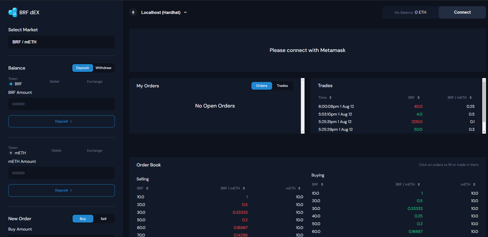
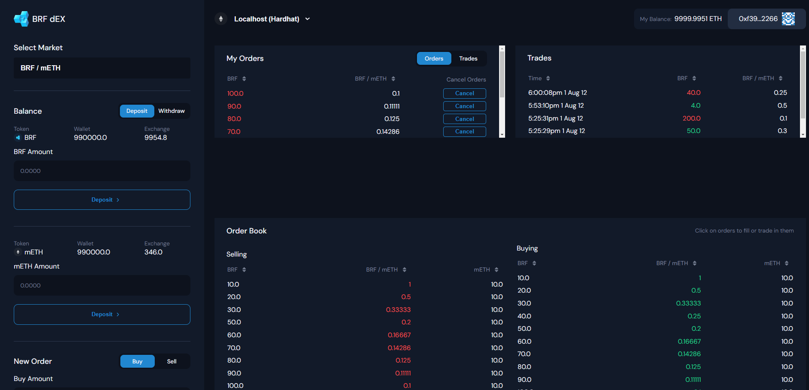
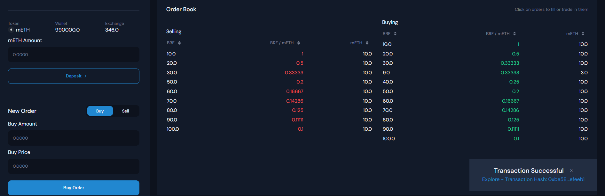

# To start the project follow these commands:

First Command:

```
npx hardhat node
```

Second Command:

```
npx hardhat run --network localhost scripts/1_deploy.js
```

Third Command:

```
npx hardhat run --network localhost scripts/2_seed-exchange.js
```

Fourth Command:

```
npm run dev
```

# Follow above commands to see project in action

Note: Following above steps will start the project

In case of any unexpected behaviour occurance, check the address of tokens and exchange from 2nd commands output match the ones in utils/addressConfig.json.
They should be same for the deploy to work correctly when using hardhat as network

---

# Below if how the app looks in several states:

---

<h2>Home Page (When account not connected)</h2>

# 

<h2>Home Page (When account is connected)</h2>

# 

<h2>Home Page (When Transaction is Successful)</h2>

# 

# To run scripts only of deployment follow these steps:

First Command:

```
npx hardhat node
```

Second Command:

```
npx hardhat run --network localhost scripts/1_deploy.js
```

Third Command:

```
npx hardhat run --network localhost scripts/2_seed-exchange.js
```

# To run tests only follow these steps:

To run all tests together:

```
npx hardhat test
```

To run Test for Token only:

```
npx hardhat test test/Token.js
```

To run Test for Exchange:

```
npx hardhat test test/Exchange.js
```
